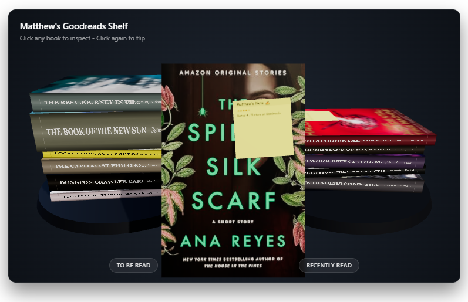

# 📚 3D Interactive Goodreads Bookshelf



An interactive 3D WebGL bookshelf widget built with **Three.js** and **GSAP**. It connects to public Goodreads shelves to procedurally render dynamic, natural-looking stacks of books for your **"To Be Read"** and **"Recently Read"** lists.

Each book features procedural dimensions derived from page counts, dynamic palette-matched spine and back-cover generation, morphing sticky-note reviews, smooth focus transitions, panning, and zoom inspection.

---

## ✨ Features

* **Procedural Book Geometry:** Generates physical book thickness based on page count, with natural jitter in position and yaw angle so stacks look casual and realistic.
* **Dynamic Texture & Palette Pipeline:** Extracts dominant and contrasting colors directly from front cover images using an offscreen 2D canvas to dynamically paint matching spines and back covers (complete with blurb, star ratings, and metadata).
* **Interactive Sticky Notes:** Books with reader reviews render a post-it note in the upper-right quadrant that curls upward via geometric morph targets when clicked.
* **Smooth Camera & Inspection Controls:**
  * Click any book to transition it into front-and-center focus.
  * Click an active book to flip it 180° and inspect the back cover.
  * Drag to pan the focused book across the camera plane.
  * Scroll wheel to zoom in up to 3x to read blurbs and notes.
  * Click empty space to return the book to its stack.
* **Embed-Ready & Responsive:** Integrated with `ResizeObserver` to fit any layout box, sidebar, or blog container without window-binding distortion.

---

## 🚀 Quick Start

### 1. Clone & Serve Locally

Because the project uses standard ES Modules (`<script type="module">`), it must be served over HTTP/HTTPS rather than opened directly as a local file (`file:///`).

```bash
# Clone the repository
git clone [https://github.com/your-username/book-flipper.git](https://github.com/your-username/book-flipper.git)
cd book-flipper

# Start a local server (choose one):
npx serve .
# or
npx vite
# or
python -m http.server 8000
```

Open `http://localhost:3000` (or `http://localhost:8000`) in your browser.

---

## ⚙️ Configuration & Customization

### 1. Point to Your Goodreads Profile

Open `main.js` and update the configuration variables at the top of the file:

```javascript
// ----------------------------------------------------------------------
// CONFIGURATION: Set your Goodreads profile URL or numeric User ID
// ----------------------------------------------------------------------
export const GOODREADS_PROFILE = '[https://www.goodreads.com/user/show/5106656-matthew-royal](https://www.goodreads.com/user/show/5106656-matthew-royal)';
export const MAX_BOOKS_PER_STACK = 6;
// ----------------------------------------------------------------------
```

> **Note:** The scraper supports either a full profile URL (e.g. `https://www.goodreads.com/user/show/1234567-username`) or just the raw numeric ID (`1234567`). Your Goodreads account privacy settings must allow public shelf viewing.

---

### 2. Configure the Backend Proxy

Goodreads restricts client-side browser requests via CORS and CloudFront WAF. A lightweight serverless proxy (such as a free Cloudflare Worker) bridges your frontend to Goodreads RSS feeds.

In `GoodreadsService.js`, update `proxyUrl` with your deployed Cloudflare Worker endpoint:

```javascript
// Inside GoodreadsService.js -> fetchGoodreadsShelf()
const proxyUrl = `[https://your-worker-subdomain.workers.dev/?id=$](https://your-worker-subdomain.workers.dev/?id=$){userId}&shelf=${shelf}`;
```

---

### 3. Customize Physical Stacking & Sizing

You can customize the physical appearance, dimensions, and randomness of the stacks in `BookStackModule.js` via `STACK_CONFIG`:

```javascript
export const STACK_CONFIG = {
  defaultWidth: 1.4,          // Base width (X axis)
  defaultHeight: 2.1,         // Base height (Z axis)
  minThickness: 0.14,        // Thinnest spine limit
  maxThickness: 0.65,        // Thickest spine limit
  pageThicknessRatio: 0.0006, // Multiplier for pageCount -> spine thickness
  stackGap: 0.006,           // Air gap between books to prevent Z-fighting
  jitter: {
    yaw: 0.12,               // Random rotation variance in radians (± ~7°)
    translationX: 0.04,      // Random offset along X
    translationZ: 0.04,      // Random offset along Z
  },
  colors: {
    pages: 0xf5eedc,         // Page trim color
    defaultCover: 0x2c3e50,  // Fallback cover color while images load
    spineEdge: 0x1a252f
  }
};
```

---

### 4. Adjust Interaction & Zoom Settings

In `BookInteractionController.js`, you can adjust how close the book sits, zoom boundaries, and hover lift distance:

```javascript
// Constructor defaults
focusDistance = 3.8;         // Fallback distance from camera
hoverLift = 0.08;            // How high a book floats on hover
this.minZoom = 0.6;          // Minimum scroll-wheel zoom out limit
this.maxZoom = 3.0;          // Maximum scroll-wheel zoom in limit
```

---

## ☁️ Cloudflare Worker Setup (Backend Proxy)

If you need to deploy your own free proxy on Cloudflare Workers:

1. Log in to the [Cloudflare Dashboard](https://dash.cloudflare.com/) and navigate to **Workers & Pages** → **Create Application** → **Create Worker**.
2. Paste the following worker script into the editor:

```javascript
export default {
  async fetch(request) {
    if (request.method === "OPTIONS") {
      return new Response(null, {
        headers: {
          "Access-Control-Allow-Origin": "*",
          "Access-Control-Allow-Methods": "GET, OPTIONS",
          "Access-Control-Allow-Headers": "*"
        }
      });
    }

    const url = new URL(request.url);
    const userId = url.searchParams.get("id");
    const shelf = url.searchParams.get("shelf") || "read";

    if (!userId) {
      return new Response("Missing 'id' query parameter", { 
        status: 400,
        headers: { "Access-Control-Allow-Origin": "*" }
      });
    }

    const goodreadsUrl = `[https://www.goodreads.com/review/list_rss/$](https://www.goodreads.com/review/list_rss/$){userId}?shelf=${shelf}`;

    try {
      const response = await fetch(goodreadsUrl, {
        method: "GET",
        headers: {
          "User-Agent": "Mozilla/5.0 (Windows NT 10.0; Win64; x64) AppleWebKit/537.36 (KHTML, like Gecko) Chrome/126.0.0.0 Safari/537.36",
          "Accept": "text/html,application/xhtml+xml,application/xml;q=0.9,image/avif,image/webp,*/*;q=0.8",
          "Accept-Language": "en-US,en;q=0.9"
        }
      });

      if (!response.ok) {
        return new Response(`Goodreads returned status ${response.status}`, {
          status: response.status,
          headers: { "Access-Control-Allow-Origin": "*" }
        });
      }

      const xmlData = await response.text();

      return new Response(xmlData, {
        headers: {
          "Content-Type": "application/xml; charset=utf-8",
          "Access-Control-Allow-Origin": "*",
          "Cache-Control": "public, max-age=1800" // Cache for 30 minutes
        }
      });
    } catch (err) {
      return new Response(err.message, {
        status: 500,
        headers: { "Access-Control-Allow-Origin": "*" }
      });
    }
  }
};
```
3. Click **Deploy**. Copy your `*.workers.dev` URL into `GoodreadsService.js`.

---

## 🎮 Interactive Controls

| Action | Control | Result |
| :--- | :--- | :--- |
| **Hover Book** | Move mouse over stack | Lifts book slightly on the Y-axis. |
| **Inspect Book** | Click on any book in a stack | Animates book into centered camera focus. |
| **Flip Book** | Click the focused book | Rotates book 180° to view the back blurb/ratings. |
| **Pan Book** | Click + Drag on focused book | Moves the book smoothly across the view plane. |
| **Zoom Book** | Scroll Wheel | Zooms in/out (0.6x to 3.0x) for reading fine text. |
| **Curl Review Note** | Click on the yellow sticky note | Curls note up/down via vertex morphing. |
| **Return to Stack** | Click empty background space | Returns the book to its resting position in the stack. |

---

## 📂 Project Structure

```text
├── index.html                  # HTML layout and WebGL container widget
├── main.js                     # App initialization, lighting, platforms, and loop
├── GoodreadsService.js         # RSS feed parser, ID extraction, and image proxying
├── BookStackModule.js          # Procedural geometry, multi-materials, and jitter algorithm
├── BackCoverGenerator.js       # Dynamic 2D canvas palette extraction for back covers & spines
├── StickyNoteModule.js         # Morph-target curling sticky note for user reviews
└── BookInteractionController.js # Raycasting, GSAP animations, drag-to-pan, and wheel zoom
```

---

## 📄 Dependencies

* [Three.js](https://threejs.org/) (r160+) - 3D Scene graph, materials, and WebGL rendering.
* [GSAP](https://greensock.com/gsap/) (3.12+) - High-performance transform and quaternion slerp tweening.
* [wsrv.nl](https://images.weserv.nl/) - Zero-config CORS image cache used for canvas pixel analysis.
```